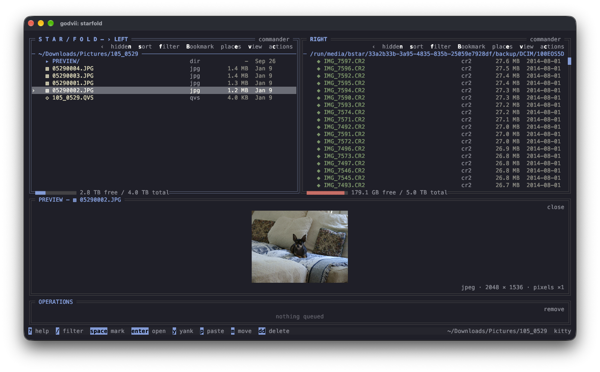

# STAR/FOLD

[](https://github.com/bstar/starfold/actions/workflows/ci.yml)
[](https://github.com/bstar/starfold/actions/workflows/nix.yml)
[](https://github.com/bstar/starfold/actions/workflows/arch.yml)
[](LICENSE)

A terminal file manager in the STAR family. The directories you drill through
stack up behind you, the files you mark stay marked wherever you go, and
file operations start immediately with progress and cancellation controls.



[Status](docs/status.md) says how much of that is built today, area by area.

Unfold your filesystem.

## Get it

Linux releases use Nix, AppImage and native Arch packages. Apple Silicon macOS builds are available
on the [releases page](https://github.com/bstar/starfold/releases/latest).

```sh
nix run github:bstar/starfold        # Nix, on Linux or Apple Silicon macOS
```

[Installing](docs/installing.md) covers every route, including building from
source. There are no system libraries to install first.

## Try it

```sh
starfold ~/projects
```

Opens the window there: `l` or `enter` drills into a directory, `h` backs out
one level, `space` marks the entry under the cursor, `y` (or `yy`) yanks the
marked entries or highlighted entry, and `p` starts a copy wherever you land.
OPERATIONS tracks the work; `ctrl+x` stops active work and pauses the queue,
and `enter` or `X` resumes it.

```sh
starfold list .
```

Prints the current directory and exits, with no window involved — the same
reader the column itself uses. [On the command line](docs/cli.md) has the
rest of it.

## What it does

- **The fold stack.** Entering a directory pushes a level onto a column; every
  level you have drilled through is still there, folded to one line, and
  `alt+up` / `alt+down` jump between them without losing anything below.
- **Persistent marks.** `space` marks a file wherever you are; the marks
  follow you to a different directory. `y` saves the marked paths for `p` to
  copy, and `m` queues a move to the current directory.
- **An operations queue.** Copies, moves, deletes, renames, compression and extraction
  start automatically in queue order, with progress, copy speed, estimated completion
  and cancellation. Deletes ask for confirmation and use Trash where available;
  permanent deletion is identified before proceeding.
- **Native drag and drop.** In terminals that support the [OSC 72 protocol](https://sw.kovidgoyal.net/kitty/dnd-protocol/),
  drag files into Fold or Commander, between panes, or out to the desktop.
  Remote sessions can transfer files over the terminal connection.
- **Intelligent previews.** Music/video tags, PDF text loaded three pages at
  a time as you scroll, archive contents, images, text and directory summaries.
  Other binary files show useful metadata. Unicode file-type icons appear in
  Fold, Commander and previews; no special font is required.
  Open an audio track to play it here using a separately installed,
  embedding-compatible STAR/AMP; without it, the existing opener still works.
- **File actions menu.** Press `c` with the Stack focused, click `actions` in its heading, Ctrl+click a
  file, or press Menu / Shift+F10 for creation, editing, compression, extraction
  and other file actions. “Copy current path” puts the open directory on the system clipboard.
  Edit runs the terminal editor in Preview. Physical right-click is enabled by default
  and can be disabled in configuration.
  Archive jobs appear in OPERATIONS.
  See [previews and archives](docs/previews-and-archives.md).
- **Recursive filename and content search.** Press F3 or Ctrl+F to search below
  the active directory; Tab in the prompt switches modes. Content results show
  a matching line and label skipped binary or oversized files. `/` still filters
  only the current directory. Results support
  preview, marks and file actions. Escape cancels a scan or closes results;
  closing restores the original directory and cursor.
- **Commander view and Places.** Press `v` for two independently browsable
  panes. `b` opens searchable bookmarks, mounted devices, network locations,
  Home and Root; selected drives show capacity and identifying details.
  `B` bookmarks the current directory.
- **Workspace tabs.** Each tab keeps its own Fold and Commander session,
  pane locations, sorting, filtering and marks. Tabs can be renamed,
  duplicated, reordered and reopened after closing.
- **Sixteen themes.** The same chrome and theme engine as the rest of the STAR
  family, so a theme set in one looks the same in another. The mouse works
  everywhere the keyboard does.
- **Linux and macOS.** x86_64 and aarch64 on Linux, Apple Silicon on macOS.

## Terminal compatibility

**For the complete terminal feature set, use Kitty 0.47 or newer, directly
or over SSH without a terminal multiplexer.** Its [OSC 72 drag-and-drop
protocol](https://sw.kovidgoyal.net/kitty/dnd-protocol/) enables file gestures
between panes, desktop applications and remote sessions. The other terminals
below can provide much of the same visual experience, but native file drag and
drop requires OSC 72; pasting a dropped filename is a different feature.

Checked against STAR/FOLD's implementation and upstream documentation on
**2026-09-30**. This is a protocol compatibility assessment, not a claim that
every emulator/version has passed interactive STAR/FOLD testing. Use current
releases; older versions and terminal settings can change the results.

| Terminal | STAR/FOLD host platforms | Pixel image previews | Synchronized redraws | Copy text to local clipboard over SSH | Native file drag/drop, including SSH |
| --- | --- | --- | --- | --- | --- |
| **Kitty 0.47+** | Linux, macOS | [Kitty graphics](https://sw.kovidgoyal.net/kitty/graphics-protocol/) | Yes | [Yes](https://sw.kovidgoyal.net/kitty/clipboard/) | **[Yes, OSC 72](https://sw.kovidgoyal.net/kitty/dnd-protocol/)** |
| **Ghostty** | Linux, macOS | [Kitty graphics](https://github.com/ghostty-org/ghostty/blob/main/README.md) | Yes | [Yes, policy dependent](https://ghostty.org/docs/vt/osc/52) | [Not implemented](https://github.com/ghostty-org/ghostty/issues/12852) |
| **WezTerm** | Linux, macOS | [iTerm2 images](https://wezterm.org/imgcat.html) | [Yes](https://wezterm.org/escape-sequences.html#mode-functions) | [Yes](https://wezterm.org/escape-sequences.html#operating-system-command-sequences) | Not documented |
| **iTerm2** | macOS | [iTerm2 images](https://iterm2.com/documentation-images.html) | Yes | [Yes, enable clipboard access](https://iterm2.com/documentation-preferences-general.html#selection) | Not documented |
| **foot** | Linux / Wayland | [Sixel](https://gitlab.com/dnkl/foot/-/raw/master/README.md) | [Yes](https://gitlab.com/dnkl/foot/-/raw/master/doc/foot-ctlseqs.7.scd) | [Yes, policy dependent](https://gitlab.com/dnkl/foot/-/raw/master/README.md) | Not documented |
| **Konsole** | Linux | [Kitty graphics / Sixel](https://github.com/KDE/konsole/blob/master/src/Vt102Emulation.cpp) | [Yes in recent versions](https://github.com/KDE/konsole/blob/master/src/Vt102Emulation.cpp) | [Yes in recent versions](https://github.com/KDE/konsole/blob/master/src/Vt102Emulation.cpp) | Not documented |
| **Alacritty** | Linux, macOS | Character blocks only | [Yes, 0.13+](https://github.com/alacritty/alacritty/blob/master/CHANGELOG.md) | [Yes, allow OSC 52 copying](https://alacritty.org/config-alacritty.html#terminal) | Not documented |

“Not documented” means OSC 72 support was not found in the reviewed upstream
documentation/source; STAR/FOLD enables it only after a successful capability
reply. Alacritty uses STAR/FOLD's half-block image fallback; upstream
[does not provide Sixel](https://github.com/alacritty/alacritty/issues/910).
[Synchronized redraws](https://gist.github.com/christianparpart/d8a62cc1ab659194337d73e399004036)
keep each complete frame together to reduce menu flicker. Unsupported terminals
normally ignore the synchronization commands and draw conventionally.

### What works everywhere, and what depends on the terminal

- **File management:** browsing, Commander, tabs, sorting/filtering, search,
  operation progress, storage bars, permissions prompts and text previews do
  not require Kitty. The terminals above provide color and mouse support for
  menus, hover, wheel scrolling and scrollbars. Terminal or desktop shortcuts
  must forward the keys/buttons to the app. No Nerd Font is required.
- **Graphics:** leave `[ui] graphics = "auto"` for capability detection.
  STAR/FOLD supports Kitty, iTerm2 and Sixel protocols and falls back to
  character blocks when detection fails. These graphics also serve embedded
  STAR/AMP artwork and controls; playback still requires a compatible STAR/AMP
  executable. Image caching, background filesystem work and copy optimizations
  apply independently of the terminal.
- **SSH:** the local emulator controls graphics, redraws and clipboard access.
  STAR/FOLD must run on the remote host. Copying a path or operation report uses
  the terminal clipboard route; OSC 52 writes have no success acknowledgement
  and can be rejected or size limited. Local desktop sessions use the system
  clipboard instead. See [drag and drop](docs/drag-and-drop.md) for file transfers.
- **tmux and other multiplexers:** they can filter graphics, clipboard, mouse
  and drag/drop sequences. STAR/FOLD deliberately uses character-block images
  under tmux in `auto` mode. A forced `graphics = "kitty"` requires correctly
  configured passthrough and a compatible outer terminal; it does not enable
  OSC 72. Run directly for the most complete experience.
- **Other terminals:** keyboard file management remains usable, while graphical
  previews, smooth redraws and remote clipboard copying depend on their protocol
  support. A terminal accepting a desktop drop does not establish support for
  STAR/FOLD file transfers.

## What it does not do yet

Recovery from Trash, bulk rename and shell picker output are on the
[file manager roadmap](docs/file-manager-roadmap.md). Commander uses two
independent directory panes alongside the Fold stack; Places can unmount a
selected local drive, while mounting, physical ejection and network login
remain jobs for the operating system.

## Read more

The [documentation](docs/README.md) has a page for each of those. The ones
most people want first:

- [The stack](docs/the-stack.md)
- [Keys and mouse](docs/keys-and-mouse.md)
- [Drag and drop](docs/drag-and-drop.md)
- [Configuration](docs/configuration.md)
- [If something is wrong](docs/troubleshooting.md)

[CONTRIBUTING.md](CONTRIBUTING.md) is for building and changing it,
[CHANGELOG.md](CHANGELOG.md) for what each release holds, and
[SECURITY.md](SECURITY.md) for reporting a vulnerability.

## License

MIT. See [LICENSE](LICENSE).


## Experimental graphics inside Kitty

The `experiment/terminal-graphics` branch adds an optional shared offscreen
renderer and persistent SSH scene relay. The remote application needs no browser
or display server. See [terminal graphics](docs/terminal-graphics.md) for build,
launch, verification and compatibility details. The ordinary TUI remains the
standard build.
