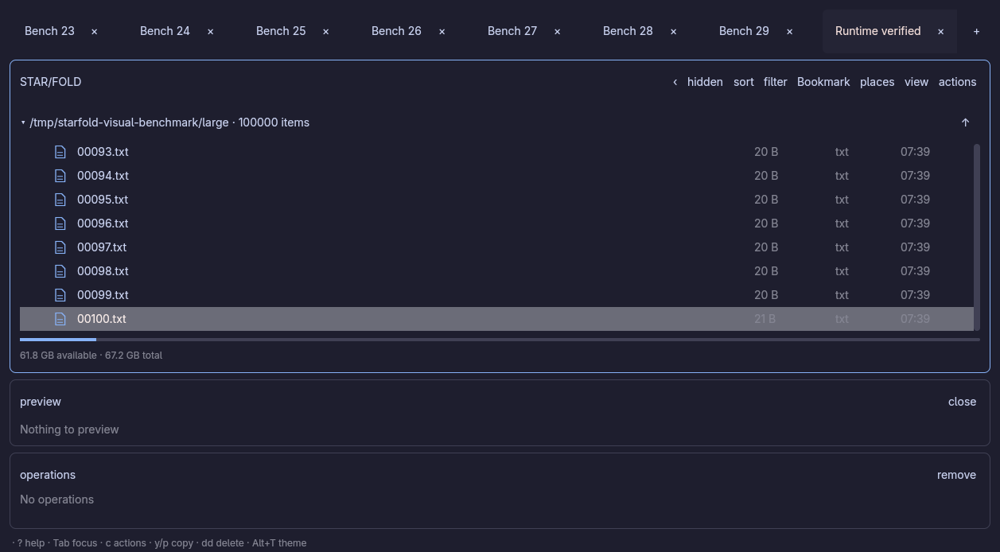
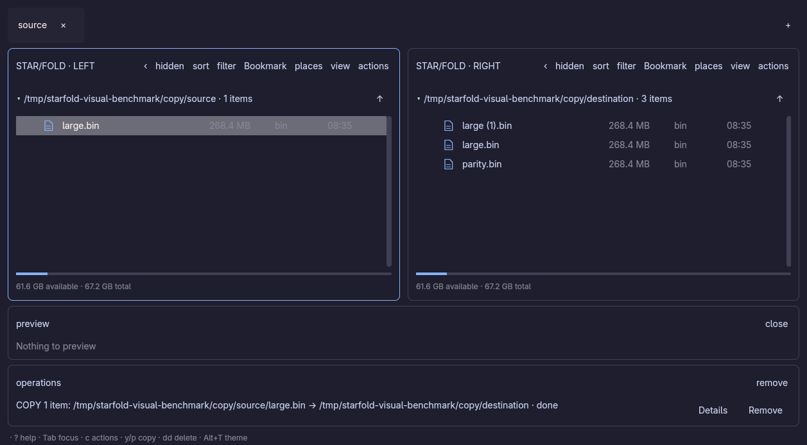
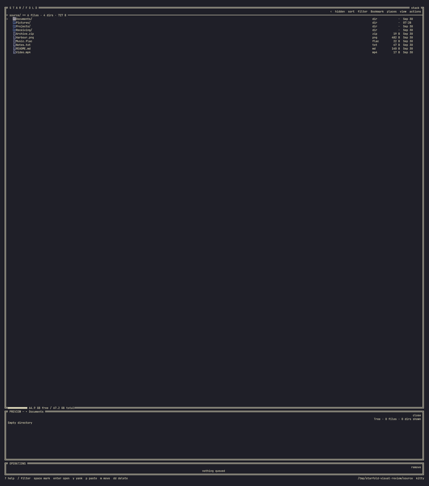

# Graphical presentation experiment

This branch is an experiment, not a release. It starts from the Recovery/Undo
branch and consumes an immutable experimental STAR/KIT commit. Nothing is merged
into main or tagged. The normal local debug launcher remains the regular app.

## Two presentations, one stack

`starfold-visual` launches enhanced terminal presentation. Add `--backend desktop`
for the native GPUI window, or `--backend plain` for ordinary terminal output.
The executable's underlying command is `starfold visual`; a desktop-capable build
uses `nix develop -c cargo build --release --locked --features desktop`.
`scripts/install-visual.sh` builds through Nix and installs the separate local
launcher. `nix run .#visual -- --backend desktop` builds the graphical Nix package.

State, sort/filter behavior, marked paths, previews, copy planning, collision
checks, capacity checks, locks, progress, cancellation and tab persistence remain
in the existing core. No filesystem operation happens during drawing. Native
rows retain actual path values, including names that cannot safely be reconstructed
from display strings. Context menus retain their clicked path and marked sources.

The native panel preserves **visited stack levels**. Folded parent rows show the
level, cached item count and remembered cursor name above the expanded active directory.
Clicking a folded level sends the existing JumpTo command. It retains descendant
frames; Alt+Down moves forward again. Filters and cursors remain per frame.
Commander renders a separate stack in each pane. This is the same navigation
model as terminal Fold, not a replacement with flat directory columns.

Each backend uses `~/.local/starfold-visual` for configuration, session and logs.
`STARFOLD_VISUAL_DIR` overrides that directory for disposable tests. It never
restores the regular STAR/FOLD workspace. Preview worker subprocess commands
remain available in the same executable.

## Shared workflows and controls

The native frontend calls the same application controller, action menus and
validation as terminal STAR/FOLD. The browser retains stack navigation; Commander
splits only the browser. Preview and Operations remain below it and accessible.
File rows have fixed height, single-line ellipsis and full-name tooltips.

Native menus expose Open, Preview, Edit, Mark, Copy, Move, Rename, Copy current
path, New, Archive, Delete, Tabs and Recovery. All existing typed dialogs have
native presentations, including editable collision names, search mode, sort
settings, trash warnings with session suppression, persistent failures and recovery.
Places includes bookmarks, drive details, refresh, unmount and empty-drive-trash
confirmations. Native clipboard actions copy paths and complete operation reports.
The embedded editor and player render through a shared STAR/KIT terminal surface.
Administrator retries offer a native password field; authorization runs off the
UI thread and can be cancelled. Operation execution stays in the existing workers.

The [shared key reference](keys-and-mouse.md) applies to both frontends:

- j/k or arrows move; Enter activates; h/Left/Backspace returns; Alt+Up/Down
  jumps between retained stack levels; gh/gr opens home/root.
- c opens Actions; r renames; Space marks; y then p copies captured paths;
  m moves; dd asks before deletion; Ctrl+Z opens Undo history.
- v toggles Commander; Tab changes panes; Alt+1/2/3 focuses browser/preview/operations.
- i toggles preview; s opens sort, S reverses direction; / or f filters;
  F3/Ctrl+F searches names/content; F5/Ctrl+R reloads.
- b/e opens Places; B bookmarks; Places uses F2 rename, F3 details, F5 refresh,
  F6 unmount and F7 empty trash.
- Ctrl+T/W opens/closes tabs; Ctrl+PageUp/PageDown switches; Ctrl+P opens tab
  actions; right-click tab menus support rename, duplicate, position and reopen.
- Alt+T cycles the shared themes and identifies the theme in the footer.

Native text fields support Unicode grapheme navigation, selection, paste and IME
composition. Ctrl/Cmd+A/C/X/V uses the native clipboard; Enter submits and Escape
cancels. Menus support arrows/j/k, nested submenus, disabled and dangerous actions.
See the [alignment checklist](graphical-parity.md) for coverage and limits.

## Shared STAR/KIT scope

Optional `visual` supplies theme tokens, seven antialiased vector icons,
rounded terminal tab ends, a bounded LRU raster cache, independent capability
flags and bounded timing diagnostics. Optional `desktop` pins official GPUI to
exactly 0.2.2 and supplies native cards, tabs, menu items, meters, modal shells,
controlled Unicode/IME text inputs and styled terminal surfaces. GPUI runtime
Metal shader compilation avoids requiring a separate Metal compiler on macOS;
SDK headers and libclang remain build requirements.

Default app features do not enable GPUI. STAR/AMP, STAR/CORD and STAR/WIRE were
checked against the shared branch in disposable worktrees without enabling
visual features. Their source and local launchers were not changed.

## Rendering and compatibility

Terminal text stays ordinary terminal text. Images occupy the existing icon
slots and padding at the ends of the selected tab. They do not cover filenames,
marks, menus or cursor cells. No arbitrary background image layering is assumed.
Menus and active drag gestures suppress those decorative placements. Unknown
pixel dimensions or unavailable image protocols retain ordinary text glyphs.
The plain backend disables images explicitly.

Experimental terminal rendering is demand driven: at most 30 updates/sec locally
and 10 over SSH, with redraws while loading, playing media, editing or responding
to state/input changes. Native rendering notifies GPUI when state/progress/input
changes, with redraws for loading indicators, active tools and dialogs. The native core is polled every
50ms. GPUI may redraw for compositor events and pointer interactions independently.

The raster cache is capped at 64 MiB and each icon surface at 512×512 pixels.
The existing transport cache is bounded by 64 entries; it is not a byte-count
limit. Native icons are cached separately with at most 128 small surfaces, and
one converted preview image is retained with its source allocation to preserve
image identity. Scaling and BGRA conversion run off the UI thread, with one
conversion in flight; stale results are never displayed for another image. Existing preview resource limits still apply.

| Presentation/environment | Graphics in this experiment | Verification |
| --- | --- | --- |
| Native Linux Wayland | GPUI/Vulkan, native widgets | Local launch verified; Linux x86_64 and ARM64 build/tests |
| Native Linux X11 | GPUI/Vulkan, native widgets | Local XWayland launch and screenshot verified |
| Native macOS ARM64 | GPUI/Metal, native widgets | Native CI build/tests; hands-on display check required |
| Kitty | Cached image icons, tab ends, previews; existing OSC72 drops | Protocol integration plus local visual check |
| Ghostty | Kitty graphics transport where negotiated; text fallback | Expected from transport; hands-on check required |
| WezTerm / iTerm2 | Inline image transport where negotiated; text fallback | Expected from transport; hands-on performance check required |
| Sixel terminals | Sixel surfaces where negotiated; text fallback | Expected from transport; hands-on repaint check required |
| Ordinary text terminals | Full text file-manager workflow | PTY startup, resizing and existing operation/drop tests |
| SSH | Local emulator's transport; lower update limit; existing OSC72 stream | Actual authenticated loopback SSH in Kitty rendered 20 image cells and exited cleanly; network latency remains unmeasured |
| tmux | Auto graphics fallback follows existing transport policy | Text path supported; image passthrough needs hands-on check |

Native desktop pixels cannot travel through an ordinary SSH terminal. The enhanced
terminal frontend is the compatible path there. Identical visuals across terminal
emulators are not a completion criterion for this prototype.

Nix-built GPUI needs a Vulkan loader and compatible driver libraries. The local
Nix shell/package includes Mesa and exposes its data directories, avoiding a
host-driver/Nix-library mismatch encountered during launch testing. Proprietary
GPU driver setups still need separate validation; no system configuration is
changed by the experiment.

## SSH

Run the terminal backend in the remote SSH session:

```sh
ssh -t your-host 'starfold-visual --backend terminal'
```

The remote host needs the experimental executable installed. Your local emulator
negotiates the image protocol; unknown graphics capabilities fall back to text.
The SSH path uses the existing remote-safe image transport and lower redraw limit.
For a smaller server build, use `--features visual` and run
`target/release/starfold visual --backend terminal`; it does not need GPUI or a
display server. The native window requires a local graphical session or a separate
remote display solution and does not travel through ordinary SSH.

A private loopback SSH server and an unconfigured Kitty window verified actual
protocol negotiation and image rendering over an SSH PTY. No regular SSH or
terminal configuration was changed. This verifies transport, not performance on
a distant host or through tmux.

## Runtime screenshots

Actual Linux renders with disposable fixtures (not mockups):







## Measurements and evidence

Release measurement on the development Linux machine:

| Measurement | Result | Scope |
| --- | --- | --- |
| Listing 10,000 actual small files | 8.548 ms | Warm local filesystem; excludes fixture creation |
| Draw p95 with 100,000 synthetic rows | 0.059 ms | 200 terminal buffer draws at 100×30; only visible rows |
| First 48×48 vector icon raster | 72 µs | One folder icon; excludes protocol encoding/upload |
| Cached surface bytes in that fixture | 9,216 bytes | Repeated access reused the same allocation |
| Native mapped-window latency | 110.8 ms | Warm Wayland launch, two-file preview fixture; mapping is not first paint |
| Native idle CPU / RSS, XWayland | 0.33% / 85.7 MiB | Three-second sample, empty panes; includes GPUI and workers |
| Native idle CPU / RSS, Wayland | 1.33% / 86.3 MiB | Three-second sample with image preview; not a settled long-term average |
| Native element construction p95 | 0.084 ms | 37 frames in a small Wayland fixture; excludes layout and GPU work |
| Native mapped-window latency, 100,000 files / 30 tabs | 162.6 ms | Warm tmpfs fixture; all 100,000 entries loaded, mapping is not first paint |
| Native settled idle CPU / RSS, large fixture | 0.30% / 199.6 MiB | Ten-second Wayland sample after four seconds of warm-up |
| Native element construction / input handling p95, large fixture | 0.295 ms / 0.738 ms | 186 frames; input reuses the cached listing snapshot, construction excludes layout and GPU work |
| 24-megapixel PNG preview ready | 572.4 ms | Includes startup, worker decode and background scaling to the visible panel; 6000×4000 source |
| Native element construction p95, large preview | 0.536 ms | Seven frames; scaling/conversion off the UI thread; excludes GPU work |
| Native 256 MiB copy publication | 108.9 ms | Disposable tmpfs source/destination; SHA-256 matched; not a physical-drive throughput measurement |

Reproduce with `nix develop -c cargo test --release --features visual
visual_performance_fixture -- --ignored --nocapture`. This command produces a
terminal-only executable in target/release; rebuild with `--features desktop`
before launching native mode.

These are CPU measurements, not a 60fps native frame-rate claim. The native log
records element-construction and input-handling p95 and frame count on clean
shutdown. GPU submission, presentation latency, encoded protocol byte counts and
slow-mount first paint remain unmeasured. The large fixture passed 100 cursor
moves, automatic viewport scrolling, active-tab visibility, tab rename, session
save and clean exit. The copy fixture also passed a second copy through the native
destination/conflict dialogs, custom name `parity.bin` and matching SHA-256.
Actual native checks also exercised bookmark/Places details, rename, a nested
New action and keyboard input/lifecycle in an embedded PTY editor. Kitty's
remote-control text dump contained image placeholder cells, confirming graphics
transport rather than just the text fallback.

Cursor movement now reuses cached rows and full paths rather than rebuilding all
100,000 labels. Listing generations, filters, marks and relative-time changes
invalidate that cache. The former 30.490ms input p95 fell to 0.738ms in the same
large fixture. This establishes CPU responsiveness for that fixture, not a full
16.7ms GPU/presentation budget. Settled idle CPU met the below-1%-of-one-core target;
other hardware and startup samples can differ.

Tests cover captured copy targets surviving navigation, queue visibility before
worker execution, real disposable copying, plain fallback at 100×30 and 60×21,
visited folded levels and per-frame filter restoration, bounded foreign raster
dimensions, cache reuse and the complete existing regression suite. Existing
terminal PTY tests cover startup without cursor replies, resize, tabs and OSC72
local/remote drops. CI adds desktop feature gates on Linux x86_64, Linux ARM64
and macOS ARM64 alongside the default app gates.

## Recommendation and gaps

Keep the native frontend optional while iterating on the stack presentation.
It provides real pixel layout and reusable STAR/KIT primitives. Preserve the
terminal frontend as the broad compatibility path; keep its graphical additions
confined to dedicated slots rather than attempting to repaint every text row
as an image. Kitty's cached placements are the preferred terminal graphics path.

The native presentation now exposes the shared file-manager workflows rather
than a separate reduced action set. It remains experimental: physical USB/mount
failures, successful administrator authorization with real credentials, assistive
technology and hands-on macOS behavior need additional validation. Platform CI
checks compilation and tests, not those device/display interactions. Native GPU
presentation latency and distant-SSH performance remain unmeasured.
